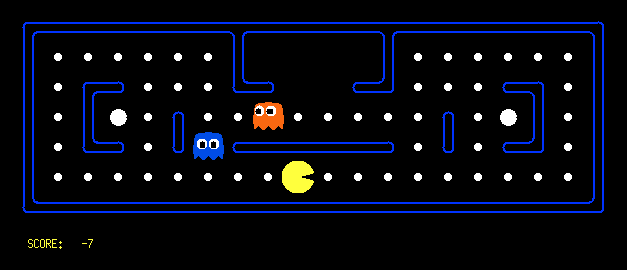

# AI Pac-Man Dev Branch

## Current Plan

### CNN Encoding (Actively Prototyping)

Use CNN to encode game state for a DQN to create policies from. Given the grid-like nature of Pac-Man, this seems like a natural extension.

Encode with 6 channels to start for the following observation space features:

- Walls
- Pellets
- Power pellets
- Ghosts
- Pac-Man
- Scared ~~ghosts~~ timer

With adaptive pooling, we should hopefully be able to create a map-agnostic encoding to be used by a Deep Q Network later on. Will have to experiment with differing output dimensions.

### Deep Q Network

Plan to use deep reinforcement to be able to determine policies more efficiently than with the tabular method used in the original project. I expect to have some trouble with the fine-tuning of this model, and will need to read more into DQNs and different ablations (Double Q-Learning, Dueling Q-Network, Prioritized Replay).

Given the encoding that I've chosen from the CNN, action space will have to be absolute-defined, rather than the relative direction method that was used later on in the original project. I'll also have to experiment with integration-testing neural networks. Should be a fun new experience!

# ORIGINAL README

# AI Pac-Man Exploration

A repository for testing AI-based solutions to Pac-Man, using the Berkeley Pac-Man Project as an environment. Complete with gymnasium-based wrapper and currently featuring a Q-learning routine for Pac-Man agents.

Read our final report [here](./final-report.pdf)



## Current Features

- Q-Learning training and replay
- Live keyboard play against ghosts of your choice
- Heatmap and histogram generation for training observation

## Directory Structure

```
gym_wrapper/ 			# Home for our Gymnasium wrapper and personal agents
├── env.py 			# ├──Main Gymnasium Environment
└── our_agents.py 		# └──Our agents
pacman_engine/ 			# Original Berkeley code updated to Python 3
├── pacman.py 			# └──These files should not need to be touched
├── game.py
└── ...
layouts/			# Directory for game layouts, stored as ASCII in
├── capsuleClassic.lay		# .lay files. Feel free to make your own!
├── contestClassic.lay
└──...
checkpoints/ 			# Directory to save checkpoint policies if enabled
├── checkpoint_policy_a.gz
└── ...
heatmaps/ 			# Directory to save heatmap images
├── heatmap.png
└── ...
histograms/ 			# Directory to save histograms
├── histogram.png
└── ...
policy_archive/ 		# Archival directory for storing previous policies
├── policy_a.gz
└── ...
keyboard_test.py 		# Program to play on a given layout
train_q.py 			# Training routine
play_q.py			# Program to replay generated policy files
```

## Usage

#### For running locally on your machine

### Import Dependencies

1. Clone the repository:

   ```bash
   git clone https://github.com/theonlynanu/QPacman.git
   ```

2. Navigate to the project directory:

   ```bash
   cd QPacman
   ```

3. Install the required packages:
   ```bash
   pip install -r requirements.txt
   ```
4. Ensure the game runs
   ```bash
   python keyboard_play.py
   ```

## Training Your Own Q-Learning Agent

### Reward Weights

Reward weights are stored at the top of `gym_wrapper/env.py`. The following are available to adjust:

```python
DIST_PENALTY_SCALE = 0	# Scaling for exponential distance
REWARD_PELLET = 10  	# Eating a pellet
REWARD_POWER = 25  	# Eating a power pellet
REWARD_GHOST = 200  	# Eating a ghost
REWARD_WIN = 500
REWARD_DEATH = -500  	# Dying.
REWARD_STEP = -0  	# Taking a step without eating a pellet
REWARD_DELAY = -1  	# Time delay applied to all steps
```

### Ghost Selection

Currently, the `env.py` file will assign an AStarGhost agent to all ghosts. Extension to assign these on the fly is currently being developed. For now, if you want to change this behavior, edit the following section starting around line `82` of `gym_wrapper/env.py`, paying mind to the comments:

```python
if ghost_agents is None:
from pacman_engine.ghost_agents import AStarGhost
shared_info = {}
ghost_agents = [
AStarGhost(1, shared_info),
# RandomGhost(1),			# Uncomment this and comment the line above for one RandomGhost
*[AStarGhost(i + 1, shared_info) for i in range(1, self.num_ghosts)]
# Change `AStarGhost` to `RandomGhost` above, and remove `shared_info` to populate all other ghosts as RandomGhosts
```

### Basic Training and Replay

Q-learning is carried out using `train_q.py`. CLI arguments and options are described below. To start, run the following example command in your terminal:

```bash
python train_q.py new_policy.gz mediumClassic standard -e 1000 -r
```

This will generate a policy based on 1000 episodes trained on the mediumClassic map.


The new policy will be saved in root as `new_policy.gz`. A heatmap will be generated as `heatmaps/standard_mediumClassic_1000_heatmap.png`, and a state-visit histogram as `histograms/standard_mediumClassic_1000_histogram.png`. They should look something like this:


To view this policy being played, run the following command in your terminal:

```bash
python play_q.py new_policy.gz mediumClassic standard
```

You should see a window pop up with an agent playing based on that policy! Expect this starting policy to perform quite poorly - 1000 episodes is next to nothing for this state space.

### Retraining vs Continuation

Saved policies also include the respective state-action visit count. This enables the progressive retraining of policies, in case one wants to engage in curriculum-based learning or something similar.

By default, `train_q.py` assumes you want to update an existing policy. To replace an existing policy with one of the same name, use the `-r` flag as we did above to replace it. All training protocols will ask for confirmation before proceeding, to prevent overwriting or deletion of policies before they are stored. The only operation that is not confirmed is training a new policy with the `-r` flag explicitly included. We've included some example policies in `policy_archive/` to play around with yourself!

### Meta-Parameter Tuning

The `train_q.py` file has the following usage:

```bash
usage: train_q.py [-h] [-r] [-s] [--episodes EPISODES] [--epsilon-start EPSILON_START] [--epsilon-min EPSILON_MIN] [-g GAMMA] [-d DECAY] [--checkpoint-prefix CHECKPOINT_PREFIX]
                  [--checkpoint-freq CHECKPOINT_FREQ]
                  policy_filepath layout_name agent_type

Train a Q-learning Pac-Man Agent

positional arguments:
  policy_filepath       Path to the .gz file from which the Q-table will be loaded from and/or saved
  layout_name           Name of layout as found in layouts/ - does not include the .lay suffix
  agent_type            standard | relative - whether to use the standard QPacman agent or the QPacmanRelative agent (relative is recommended)

options:
  -h, --help            show this help message and exit
  -r, --restart         Overwrite existing q table (default: False)
  -s, --save-checkpoints
                        Periodically store checkpoint files in checkpoints/ (default: False)
  --episodes EPISODES, -e EPISODES
                        Number of training episodes (default: 50000)
  --epsilon-start EPSILON_START
                        Starting epsilon for epsilon-greedy decay (default: 1)
  --epsilon-min EPSILON_MIN
                        Floor for epsilon decay - prevent unecessarily long floating point comparisons (default: 0.0001)
  -g GAMMA, --gamma GAMMA
                        Discount factor for future reward (default: 0.99)
  -d DECAY, --decay DECAY
                        Per-episode decay rate (default: 0.9999)
  --checkpoint-prefix CHECKPOINT_PREFIX
                        Prefix for each checkpoint policy, followed by '_[episode_number].gz'. (default: checkpoint)
  --checkpoint-freq CHECKPOINT_FREQ
                        Frequency with which to save a checkpoint - will save every X episodes (default: 5000)
```

This can also be seen by running `python train_q.py -h`.

The `agent_type` can be either `standard` or `relative`. The standard agent uses `North`, `South`, `East`, and `West` as actions, while the relative agent uses `Forward`, `Reverse`, `Left`, and `Right`. Please note that while the relative agent tends to perform better, it has a higher memory requirement during training that may cause issues for high episode counts.

Also of note is the ability to save checkpoints with specified frequency and particular filenames, in case you'd like to check changes in behavior over the course of training. This is particularly helpful for training periods with high episode counts. These interstitial policies will be saved in the `checkpoints/` directory.

`epsilon-start` is the starting epsilon value for the training period, which will be decayed by the `decay-rate` after each episode until reaching `epsilon-min`.

An example of a more detailed training call:

```bash
python train_q.py old_policy.gz smallClassic relative -s -e 100000 --epsilon-start 0.8 --epsilon-min 0.00001 -g 0.95 -d 0.9995 --checkpoint-prefix pol_update_12 --checkpoint-freq 5000
```

This allows extremely granular tuning of the training variables, all without needing to edit the code itself.

### Decay Rate Choice

The following table may be helpful for selecting an appropriate decay rate during training of various episode-counts, showing the value of epsilon at a given episode count for a few popular decay rates:

| Episodes | d = 0.999    | d = 0.9995   | d = 0.9999  | d = 0.99995 | d = 0.99999 |
| -------- | ------------ | ------------ | ----------- | ----------- | ----------- |
| 10 000   | 4.52 × 10⁻⁵  | 6.73 × 10⁻³  | 0.368       | 0.607       | 0.905       |
| 20 000   | 2.04 × 10⁻⁹  | 4.53 × 10⁻⁵  | 0.135       | 0.368       | 0.819       |
| 30 000   | 9.22 × 10⁻¹⁴ | 3.05 × 10⁻⁷  | 0.050       | 0.223       | 0.741       |
| 40 000   | 4.16 × 10⁻¹⁸ | 2.05 × 10⁻⁹  | 0.018       | 0.135       | 0.670       |
| 50 000   | 1.88 × 10⁻²² | 1.38 × 10⁻¹¹ | 6.74 × 10⁻³ | 0.082       | 0.607       |
| 60 000   | 8.50 × 10⁻²⁷ | 9.33 × 10⁻¹⁴ | 2.49 × 10⁻³ | 0.050       | 0.549       |
| 70 000   | 3.84 × 10⁻³¹ | 6.31 × 10⁻¹⁶ | 9.20 × 10⁻⁴ | 0.030       | 0.497       |
| 80 000   | 1.73 × 10⁻³⁵ | 4.27 × 10⁻¹⁸ | 3.40 × 10⁻⁴ | 0.018       | 0.449       |
| 90 000   | 7.83 × 10⁻⁴⁰ | 2.89 × 10⁻²⁰ | 1.25 × 10⁻⁴ | 0.011       | 0.407       |
| 100 000  | 3.54 × 10⁻⁴⁴ | 1.96 × 10⁻²² | 4.60 × 10⁻⁵ | 0.007       | 0.368       |

The ending epsilon value should be printed when a training cycle completes, allowing you to resume training from the same epsilon value if need be. Please note that exceeding 100,000 episodes can be quite time-intensive, and doing so with the relative agent will be quite memory-intensive as well. If you're getting crashes, it may be a good idea to split training up into multiple rounds, making sure to adjust starting and ending epsilon values accordingly.

## Future Enhancements

- Allowing for terminal-level refinement of reward structure
- Better selection of ghost agents for a given layout
- Development of a Convolutional Neural Network to learn the game against A\* ghosts
- Development of a Deep-Q Network to learn the game against A\* ghosts

Please feel free to make a pull request or send me a message via my [website](https://danyalahmed.dev) if you have any other suggestions!
